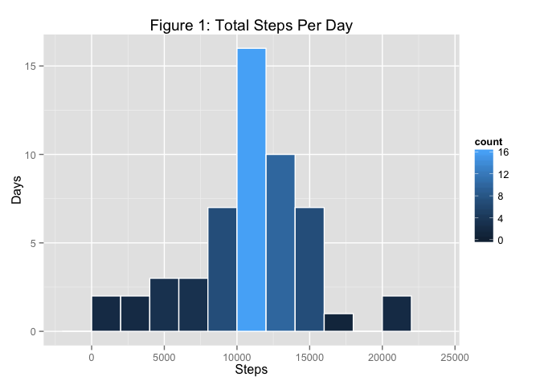
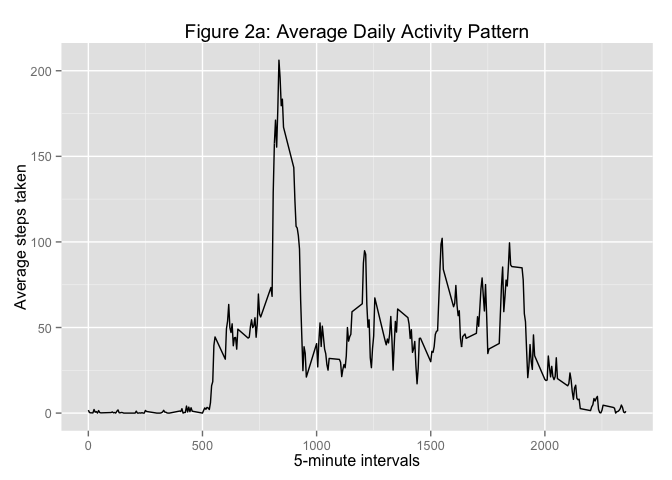
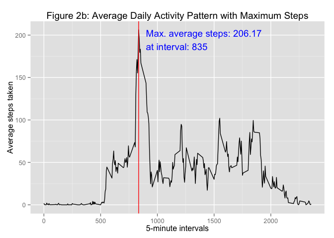
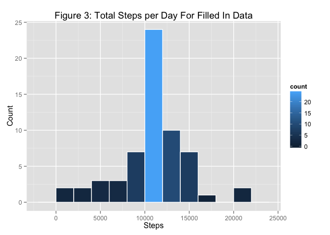
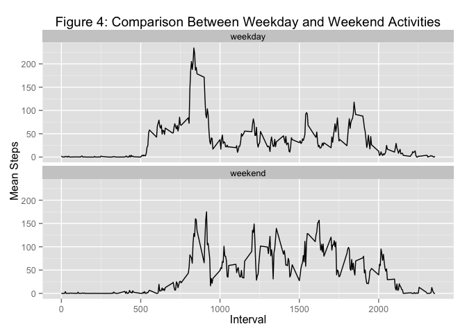

# Reproducible Research: Peer Assessment 1


## Loading and preprocessing the data


```r
unzip(zipfile="activity.zip")
activity <- read.csv("activity.csv")
```


## What is mean total number of steps taken per day?

1. Make a histogram of the total number of steps taken each day


```r
library(ggplot2)
dailySteps <- aggregate(steps ~ date, activity, FUN = sum, na.action = na.omit)
ggplot(dailySteps, aes(x = steps)) + 
    geom_histogram(aes(fill = ..count.., ), colour = "white", binwidth = 2000) + 
    labs(title="Figure 1: Total Steps Per Day", x = "Steps", y = "Days") 
```

 

2. Calculate and report the mean and median total number of steps taken per day


```r
mean(dailySteps$steps)
```

```
## [1] 10766.19
```

```r
median(dailySteps$steps)
```

```
## [1] 10765
```

## What is the average daily activity pattern?

1. Make a time series plot (i.e. type = "l") of the 5-minute interval (x-axis) and the average number of steps taken, averaged across all days (y-axis)


```r
averages <- aggregate(x=list(steps=activity$steps), by=list(interval=activity$interval),
                      FUN=mean, na.rm=TRUE)
theGgPlot <- ggplot(data=averages, aes(x=interval, y=steps)) +
    geom_line() +
    xlab("5-minute intervals") +
    ylab("Average steps taken") +
    labs(title = "Figure 2a: Average Daily Activity Pattern")
theGgPlot
```

 

2. Which 5-minute interval, on average across all the days in the dataset, contains the maximum number of steps?

```r
maxAverage <- max(averages$steps)
maxAverage
```

```
## [1] 206.1698
```

```r
max_steps_interval <- averages$interval[which(averages$steps == maxAverage)]
max_steps_interval
```

```
## [1] 835
```

```r
theGgPlot <- ggplot(data=averages, aes(x=interval, y=steps)) +
    geom_line() +
    xlab("5-minute intervals") +
    ylab("Average steps taken") +
    labs(title = "Figure 2b: Average Daily Activity Pattern with Maximum Steps")
theGGPlot <- theGgPlot + labs(title="Plant growth")
theGgPlot <- theGgPlot + geom_vline(xintercept = max_steps_interval, color="red") + 
    annotate("text", x = 65 + max_steps_interval, y = maxAverage,
             label = paste("Max. average steps:",
                           format(round(maxAverage, 2), nsmall = 2),
                           "\nat interval:",
                           max_steps_interval),
             color="blue", hjust = 0, vjust = 1)
theGgPlot
```

 


## Imputing missing values

1. Calculate and report the total number of missing values in the dataset (i.e. the total number of rows with NAs)


```r
sum(is.na(activity))
```

```
## [1] 2304
```
2. Devise a strategy for filling in all of the missing values in the dataset. The strategy does not need to be sophisticated. For example, you could use the mean/median for that day, or the mean for that 5-minute interval, etc.

We will use the mean for that day to fill in all the missing values.

3. Create a new dataset that is equal to the original dataset but with the missing data filled in.


```r
# create a copy of the original data set
filledCopy <- activity
# Replace all NA steps values with the average number of steps for that interval
which <- which(is.na(activity$steps))
intervals <- activity[which, "interval"]
filledCopy[which, "steps"] <- averages[averages == activity[which, "interval"], "steps"]
```

4. Make a histogram of the total number of steps taken each day and Calculate and report the mean and median total number of steps taken per day. Do these values differ from the estimates from the first part of the assignment? What is the impact of imputing missing data on the estimates of the total daily number of steps?


```r
dailyStepsForFilledCopy <- aggregate(steps ~ date, filledCopy, FUN = sum)

theGgPlot <- ggplot(dailyStepsForFilledCopy, aes(x = steps)) + 
    geom_histogram(colour = "white", aes(fill = ..count..), binwidth = 2000) + 
    labs(x = "Steps") + 
    labs(y = "Count") + 
    labs(title = "Figure 3: Total Steps per Day For Filled In Data") 
theGgPlot
```

 
The mean and median are: 


```r
mean(dailyStepsForFilledCopy$steps)
```

```
## [1] 10766.19
```

```r
median(dailyStepsForFilledCopy$steps)
```

```
## [1] 10766.19
```

By comparing Figure 1 and Figure 3, we see that there is very minimal change after filling in data using the mean daily step values. Even the mean and median values did not change significantly.

## Are there differences in activity patterns between weekdays and weekends?

1. Create a new factor variable in the dataset with two levels -- "weekday" and "weekend" indicating whether a given date is a weekday or weekend day.


```r
days <- weekdays(as.Date(activity$date)) %in% c('Saturday','Sunday')
# Create extra factor variable in the data set
activity$weekday <- factor(days, labels = c("weekday", "weekend"))
```

2. Make a panel plot containing a time series plot (i.e. type = "l") of the 5-minute interval (x-axis) and the average number of steps taken, averaged across all weekday days or weekend days (y-axis). The plot should look something like the following, which was created using simulated data:


```r
weekDayAverages <- aggregate(steps ~ interval + weekday, activity, FUN = mean)

ggplot(weekDayAverages, aes(x = interval, y = steps)) + 
    facet_wrap(~ weekday, ncol = 1) + 
    geom_line() + 
    labs(x = "Interval") + 
    labs(y = "Mean Steps") + 
    labs(title = "Figure 4: Comparison Between Weekday and Weekend Activities")
```

 

Figure 4 indicates that weekday activities rise earlier and peaks higher in the morning than during the weekend. 

